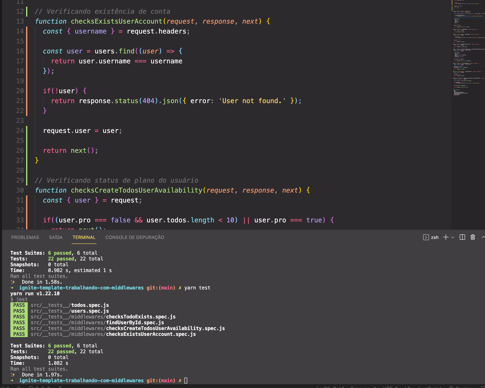

# Desafio 02 - Trabalhando com middlewares

## 💻 Sobre o desafio
Nesse desafio você irá trabalhar mais a fundo com middlewares no Express.

Para facilitar um pouco mais do conhecimento da regra de negócio, você irá trabalhar com a mesma aplicação do desafio anterior: uma aplicação para gerenciar tarefas (ou *todos*) mas com algumas mudanças.

Será permitida a criação de um usuário com `name` e `username`, bem como fazer o CRUD de *todos*

### Requisitos

-[X] Criar um novo *todo*;
-[X] Listar todos os *todos*;
-[X] Alterar o `title` e `deadline` de um *todo* existente;
-[X] Marcar um *todo* como feito;
-[X] Excluir um *todo*;

Tudo isso para cada usuário em específico. Além disso, dessa vez teremos um plano grátis onde o usuário só pode criar até dez *todos* e um plano Pro que irá permitir criar *todos* ilimitados, isso tudo usando middlewares para fazer as validações necessárias.

### Tecnologias utilizadas
- Node
- Jest
- Cors
- Express
- Nodemon
- Insomnia

### Testes utilizados:

Para esse desafio, temos os seguintes testes:
- **Should be able to find user by username in header and pass it to request.user**
- **Should not be able to find a non existing user by username in header**
- **Should be able to let user create a new todo when is in free plan and have less than ten todos**
- **Should not be able to let user create a new todo when is not Pro and already have ten todos**
- **Should be able to let user create infinite new todos when is in Pro plan**
- **Should be able to put user and todo in request when both exits**
- **Should not be able to put user and todo in request when user does not exists**
- **Should not be able to put user and todo in request when todo id is not uuid**

### Demo
<h1 align="center">
  
</h1>